# Admin User Guide

## Formative AI - Administrator Flow Document

This guide provides comprehensive instructions for administrators to navigate and utilize all features of the Formative AI assessment platform.

---

## Table of Contents

1. [Getting Started](#getting-started)
2. [Admin Dashboard](#admin-dashboard)
3. [Analytics Dashboard](#analytics-dashboard)
4. [Student Management](#student-management)
5. [Assessment Management](#assessment-management)
6. [Reports & Data Export](#reports--data-export)
7. [Classroom Observations](#classroom-observations)
8. [Navigation Quick Reference](#navigation-quick-reference)

---

## Getting Started

### Accessing the Admin Panel

1. Navigate to the application login page
2. Enter your admin credentials (email and password)
3. Select **Admin** as your role
4. Click **Login**

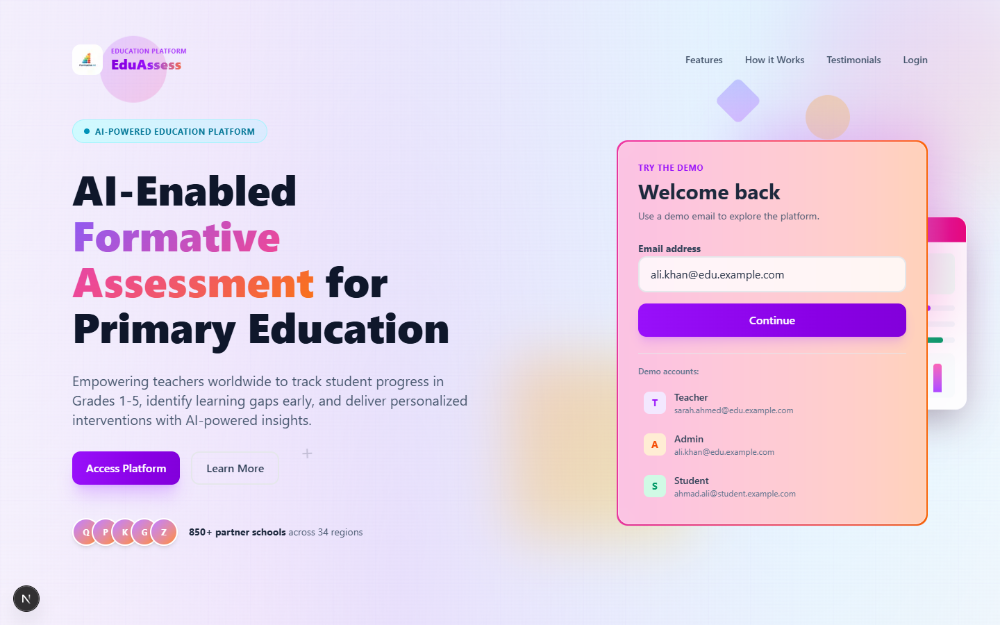
*Figure 1: Login page with role selection*

Upon successful authentication, you will be redirected to the Admin Dashboard.

### Navigation

The sidebar on the left contains all admin navigation options:

| Menu Item | Description |
|-----------|-------------|
| Dashboard | Main admin overview page |
| All Assessments | View and manage assessments |
| All Students | View and manage students |
| Analytics | Detailed analytics and visualizations |
| Reports | Generate and export reports |
| Observations | View classroom observation records |

---

## Admin Dashboard

**Route:** `/dashboard/admin`

The Admin Dashboard is your central hub for monitoring the entire system at a glance.

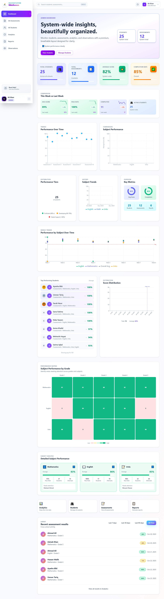
*Figure 2: Admin Dashboard - Full overview*

### Overview Section

At the top of the dashboard, you'll find:

- **System Status Indicator** - Shows if the system is operational
- **Date/Time Information** - Current date and time display

### Key Statistics Cards

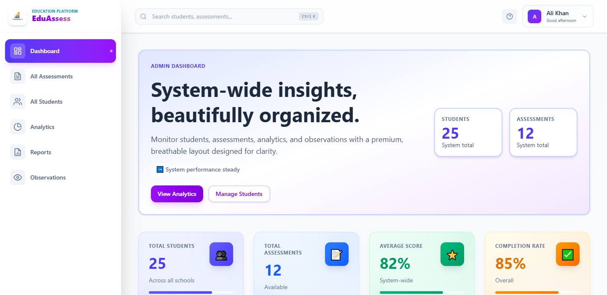
*Figure 3: Key statistics cards showing system metrics*

Four main metric cards display:

| Metric | Description |
|--------|-------------|
| **Total Students** | Number of students registered in the system |
| **Total Assessments** | Number of assessments available |
| **Average Score** | System-wide average performance percentage |
| **Completion Rate** | Percentage of started assessments that were completed |

### Week-over-Week Comparison

This section compares current week performance against the previous week:

- **Average Score Change** - Shows improvement or decline
- **Pass Rate Change** - Tracks passing rate trends
- **Completed Assessments** - Number of assessments completed this week
- **Active Students** - Students who took assessments this week

### Performance Charts

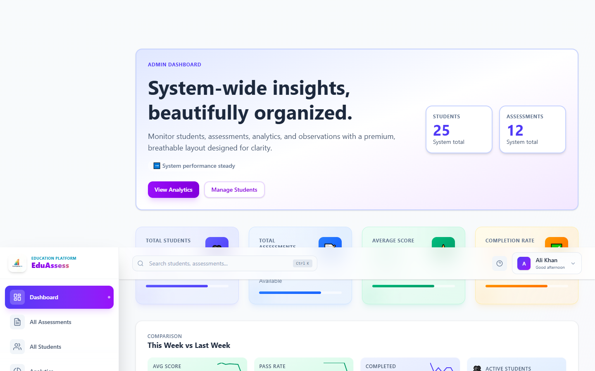
*Figure 4: Performance visualization charts*

Multiple visualization types help you understand system performance:

1. **Performance Over Time (Line Chart)**
   - Tracks score trends over selected time period
   - Hover over points to see exact values

2. **Subject Performance (Bar Chart)**
   - Compares average scores across Mathematics, English, and Urdu
   - Color-coded by subject

3. **Performance Tier Distribution (Donut Chart)**
   - Shows distribution of High (80%+), Medium (60-79%), and Low (<60%) performers
   - Click segments for details

4. **Subject Trends (Area Chart)**
   - Visualizes how each subject's performance changes over time

5. **Progress Rings**
   - Visual circular indicators for Average Score and Completion Rate

### Student Rankings

Displays top-performing students with:
- Student name
- Grade level
- Average score
- Trend indicator (improving/declining)

### Subject Performance Breakdown

For each subject (Mathematics, English, Urdu), view:
- Average score with progress bar
- Pass rate percentage
- Number of students
- Areas needing attention

### Recent Assessment Results

Shows the 6 most recent assessment submissions:
- Student name
- Assessment title
- Score achieved
- Date completed

### Quick Actions

Cards at the bottom provide quick navigation to:
- View All Students
- View Analytics
- Generate Reports

---

## Analytics Dashboard

**Route:** `/dashboard/admin/analytics`

The Analytics Dashboard provides in-depth data analysis and visualization tools.

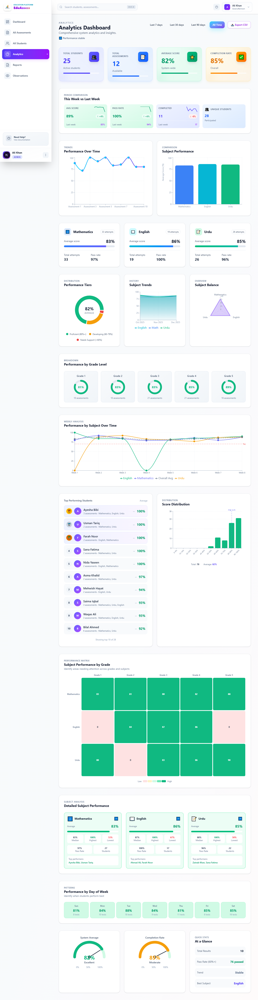
*Figure 5: Analytics Dashboard - Comprehensive data analysis*

### Date Range Filter

Located at the top-right, allows filtering data by:
- **All Time** - View all historical data
- **This Week** - Last 7 days
- **This Month** - Last 30 days

### Export Function

Click the **Export CSV** button to download all analytics data in spreadsheet format.

### Key Metrics Panel

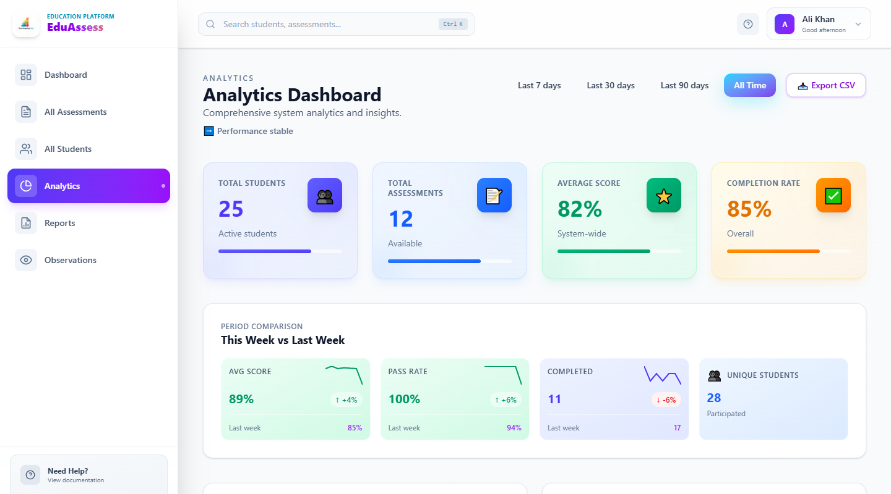
*Figure 6: Key metrics with sparkline trends*

Same four key statistics as the main dashboard, with sparkline mini-charts showing 7-day trends.

### Week-over-Week Analysis

Detailed comparison showing:
- Current week average vs Previous week average
- Pass rate comparison
- Assessment completion counts
- Active student counts

### Subject Breakdown Cards

Three cards showing detailed metrics for each subject:

**For each subject (Mathematics, English, Urdu):**
- Average score with visual progress bar
- Total number of attempts
- Pass rate (students scoring 60%+)
- Color-coded status indicators

### Advanced Charts

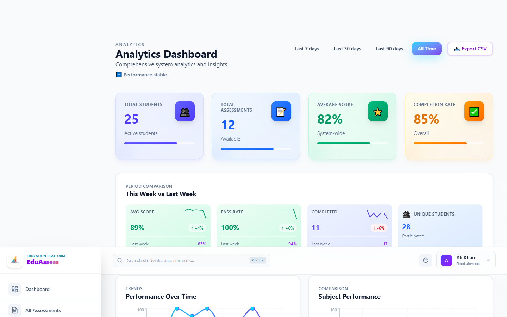
*Figure 7: Advanced analytics visualizations*

1. **Performance Over Time**
   - Multi-point line chart
   - Shows overall system performance trends

2. **Subject Performance Comparison**
   - Bar chart comparing all subjects side-by-side

3. **Performance Distribution**
   - Donut chart showing High/Medium/Low performer ratios

4. **Subject Trends**
   - Area chart tracking each subject independently

5. **Subject Balance (Radar Chart)**
   - Shows how balanced performance is across all subjects
   - Ideal shape is a uniform triangle

6. **Grade-Level Analysis**
   - Progress rings for Grades 1-5
   - Shows average performance per grade
   - Assessment count per grade

7. **Weekly Trend Chart**
   - Multi-line chart with all subjects plus overall average
   - Target line at 70% for reference

8. **Score Distribution Histogram**
   - Shows frequency of scores across ranges (0-20, 20-40, etc.)

9. **Subject x Grade Heatmap**
   - Matrix showing performance at intersection of subject and grade
   - Darker colors indicate higher performance

10. **Time Pattern Analysis**
    - Performance breakdown by day of week
    - Identifies best and worst performing days
    - Useful for scheduling insights

### Gauge Charts

- **System Average Gauge** - Visual meter showing overall average
- **Completion Rate Gauge** - Visual meter showing completion percentage

### Quick Stats Panel

Summary statistics including:
- Total assessment results
- Overall pass rate
- Performance trend (improving/stable/declining)
- Best performing subject

---

## Student Management

**Route:** `/dashboard/admin/students`

Manage and monitor all students registered in the system.

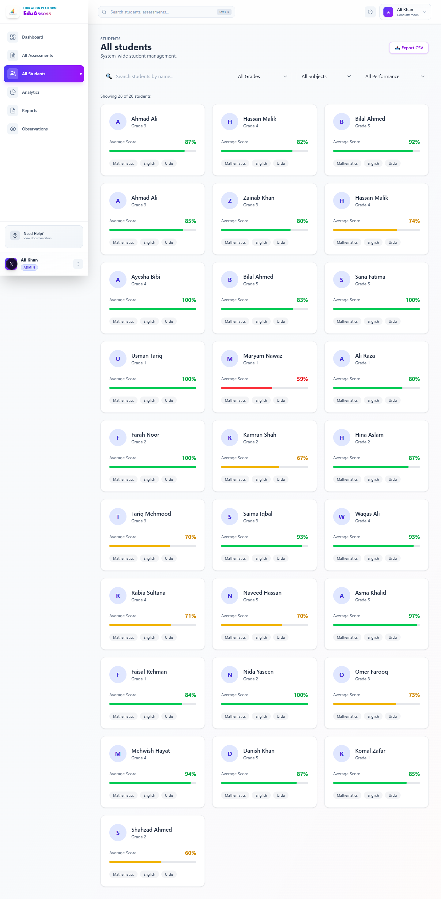
*Figure 8: Student Management page*

### Search and Filter Options

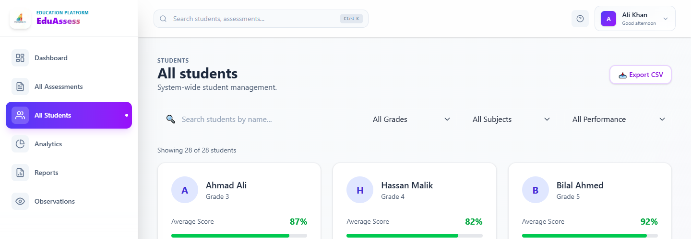
*Figure 9: Search and filter controls*

**Search Bar:**
- Type student name to search
- Real-time filtering as you type

**Filter Dropdowns:**

| Filter | Options |
|--------|---------|
| Grade | All Grades, Grade 1, Grade 2, Grade 3, Grade 4, Grade 5 |
| Subject | All Subjects, Mathematics, English, Urdu |
| Performance | All Levels, High (80%+), Medium (60-79%), Low (<60%) |

### Student Count

Shows "Showing X of Y students" to indicate filtered results vs total.

### Export Students

Click **Export CSV** to download the filtered student list with all details.

### Student Cards

Each student is displayed as a card showing:

| Element | Description |
|---------|-------------|
| **Avatar** | Initial-based colored avatar |
| **Name** | Student's full name |
| **Grade** | Grade level badge |
| **Average Score** | Percentage with color coding |
| **Progress Bar** | Visual representation of score |
| **Subject Tags** | Subjects the student has taken |

**Score Color Coding:**
- Green: 80% and above (High performer)
- Yellow: 60-79% (Medium performer)
- Red: Below 60% (Needs attention)

### Using Filters Effectively

**Example Use Cases:**

1. **Find struggling students in Grade 3 Math:**
   - Set Grade to "Grade 3"
   - Set Subject to "Mathematics"
   - Set Performance to "Low (<60%)"

2. **Export high performers for recognition:**
   - Set Performance to "High (80%+)"
   - Click Export CSV

3. **Search for specific student:**
   - Type name in search bar
   - Results update instantly

---

## Assessment Management

**Route:** `/dashboard/admin/assessments`

View, search, and manage all assessments in the system.

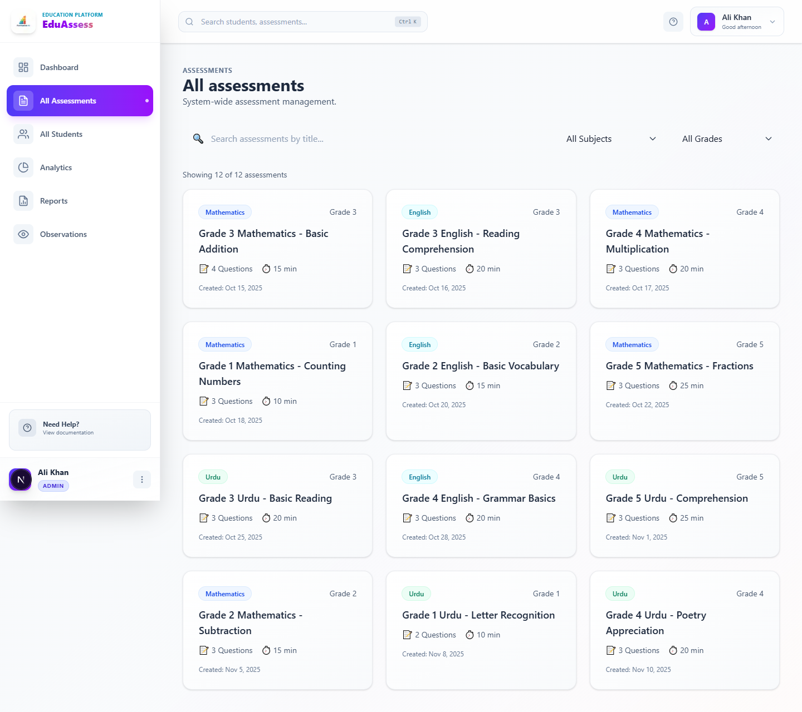
*Figure 10: Assessment Management page*

### Search and Filter

**Search Bar:**
- Search assessments by title
- Instant filtering as you type

**Filters:**

| Filter | Options |
|--------|---------|
| Subject | All Subjects, Mathematics, English, Urdu |
| Grade | All Grades, Grade 1-5 |

### Assessment Count

Displays total number of assessments matching current filters.

### Assessment Cards

Each assessment displays:

| Element | Description |
|---------|-------------|
| **Subject Badge** | Color-coded subject indicator |
| **Grade Level** | Target grade for the assessment |
| **Title** | Assessment name |
| **Questions** | Number of questions in the assessment |
| **Duration** | Time limit in minutes |
| **Created Date** | When the assessment was created |
| **Delete Button** | Only for custom assessments |

**Subject Color Codes:**
- Mathematics: Blue badge
- English: Cyan/Teal badge
- Urdu: Green badge

### Deleting Assessments

- Only custom assessments (created by teachers) can be deleted
- Pre-built assessments are protected and cannot be removed
- Click the delete button and confirm to remove

### Assessment Types

1. **Pre-built Assessments**
   - Created by system administrators
   - Cannot be modified or deleted
   - Standard curriculum-aligned content

2. **Custom Assessments**
   - Created by teachers
   - Can be deleted by admins
   - Identified by "custom-" prefix in ID

---

## Reports & Data Export

**Route:** `/dashboard/admin/reports`

Generate comprehensive reports and export data in various formats.

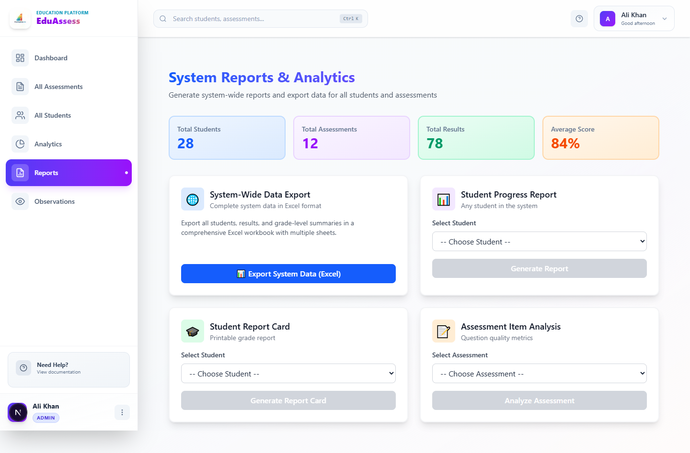
*Figure 11: Reports & Data Export page*

### System Overview

At the top, view quick statistics:
- Total Students
- Total Assessments
- Total Results
- System Average Score

### Available Report Types

#### 1. System-Wide Data Export

**Purpose:** Export all system data for external analysis

**What's Included:**
- All student records
- All assessment results
- Grade-level summaries
- Subject performance data

**Export Format:** Excel workbook with multiple sheets

**How to Use:**
1. Click "System-Wide Data Export" card
2. Click "Export to Excel" button
3. File downloads automatically

---

#### 2. Student Progress Report

**Purpose:** Generate detailed progress report for individual students

**What's Included:**
- Student information
- All assessment results
- Performance trends over time
- Subject-wise breakdown
- Strengths and areas for improvement

**How to Use:**
1. Click "Student Progress Report" card
2. Select a student from the dropdown
3. View the generated report
4. Export as PDF or Excel using the buttons

---

#### 3. Student Report Card

**Purpose:** Generate printable grade report card

**What's Included:**
- Student details
- Subject grades
- Overall performance
- Teacher comments section
- Formatted for printing

**How to Use:**
1. Click "Student Report Card" card
2. Select a student from the dropdown
3. Review the report card preview
4. Click "Print" to print directly
5. Or click "Export PDF" to save digitally

---

#### 4. Assessment Item Analysis

**Purpose:** Analyze individual assessment question performance

**What's Included:**
- Question-by-question analysis
- Difficulty index for each question
- Discrimination index
- Most commonly missed questions
- Student response patterns

**How to Use:**
1. Click "Assessment Item Analysis" card
2. Select an assessment from the dropdown
3. View the detailed analysis
4. Export as PDF or Excel for records

### Navigating Reports

- Click any report card to select that report type
- Use the "Back to Reports" button to return to report selection
- All exports are timestamped for record-keeping

---

## Classroom Observations

**Route:** `/dashboard/admin/observations`

View classroom observation records submitted by observers.

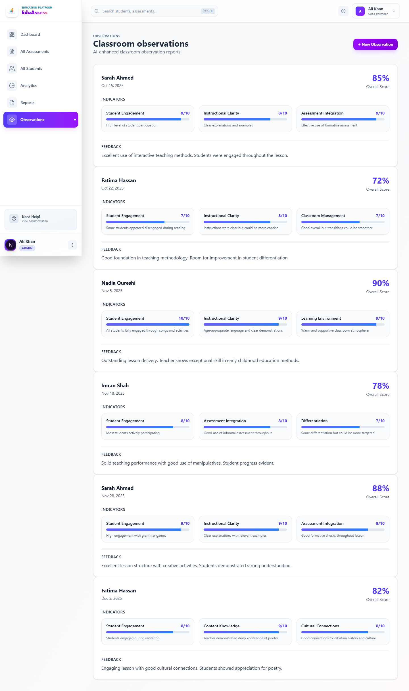
*Figure 12: Classroom Observations page*

### Observation List

Each observation entry shows:
- Teacher name
- Observation date
- Overall score (percentage)

### Observation Details

Click on an observation to view:

#### Indicators Section

For each observation indicator:

| Field | Description |
|-------|-------------|
| **Indicator Name** | What was being observed |
| **Score** | Points earned |
| **Max Score** | Maximum possible points |
| **Progress Bar** | Visual score representation |
| **Notes** | Observer's comments |

#### Feedback Section

- AI-enhanced feedback text
- Suggestions for improvement
- Strengths identified

### Observation Indicators

Common indicators include:
- Classroom management
- Student engagement
- Teaching methodology
- Content delivery
- Assessment practices
- Learning environment

---

## Navigation Quick Reference

### Keyboard Shortcuts

| Action | Description |
|--------|-------------|
| Click sidebar item | Navigate to that page |
| Browser back | Return to previous page |

### Quick Navigation Paths

| From | To | How |
|------|-----|-----|
| Any page | Dashboard | Click "Dashboard" in sidebar |
| Dashboard | Analytics | Click "Analytics" in sidebar or Quick Action card |
| Dashboard | Students | Click "All Students" in sidebar or Quick Action card |
| Dashboard | Reports | Click "Reports" in sidebar or Quick Action card |
| Reports | Dashboard | Click "Dashboard" in sidebar |
| Any page | Logout | Click profile icon > Logout |

### URL Reference

| Page | URL |
|------|-----|
| Admin Dashboard | `/dashboard/admin` |
| Analytics | `/dashboard/admin/analytics` |
| Students | `/dashboard/admin/students` |
| Assessments | `/dashboard/admin/assessments` |
| Reports | `/dashboard/admin/reports` |
| Observations | `/dashboard/admin/observations` |

---

## Troubleshooting

### Common Issues

**Issue:** Page shows "Loading..."
- **Solution:** Wait a few seconds for data to load. If persistent, refresh the page.

**Issue:** No data appearing in charts
- **Solution:** Check if the date range filter is too restrictive. Try "All Time" option.

**Issue:** Cannot delete an assessment
- **Solution:** Only custom assessments can be deleted. Pre-built assessments are protected.

**Issue:** Export not downloading
- **Solution:** Check browser download settings. Allow downloads from this site.

**Issue:** Redirected to wrong dashboard
- **Solution:** Ensure you logged in with Admin role selected.

### Getting Help

If you encounter issues not covered in this guide:
1. Contact system support
2. Check for system announcements
3. Review the FAQ section

---

## Best Practices

### Daily Tasks

1. Check the Admin Dashboard for system overview
2. Review any new assessment results
3. Monitor student performance trends

### Weekly Tasks

1. Generate analytics reports
2. Identify struggling students
3. Review subject performance
4. Export data for record-keeping

### Monthly Tasks

1. Generate comprehensive reports
2. Review observation records
3. Analyze long-term trends
4. Export system-wide data backup

---

## Data Privacy

As an administrator, you have access to sensitive student data. Please ensure:

- Do not share login credentials
- Export data only for legitimate purposes
- Follow your institution's data protection policies
- Log out when leaving the workstation

---

*Document Version: 1.0*
*Last Updated: December 2024*
*For: Formative AI Assessment Platform*
